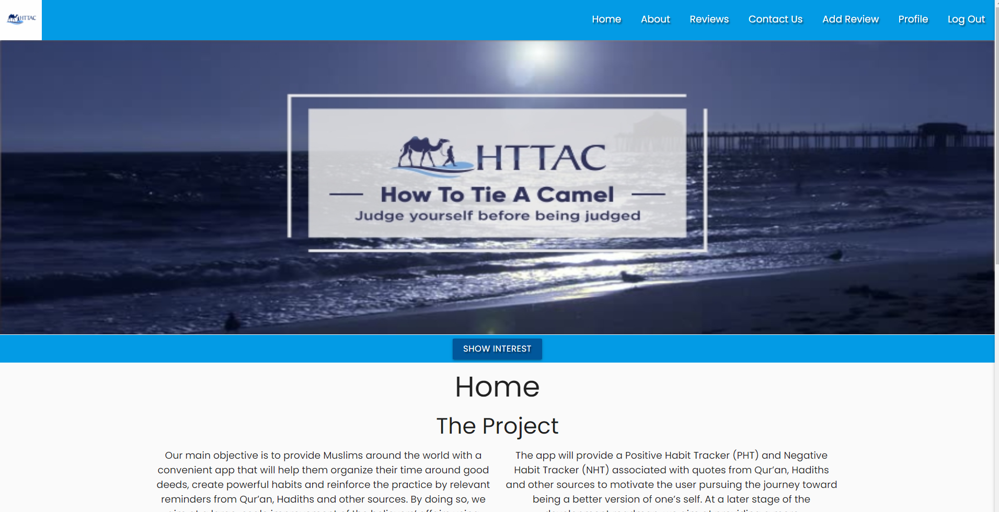
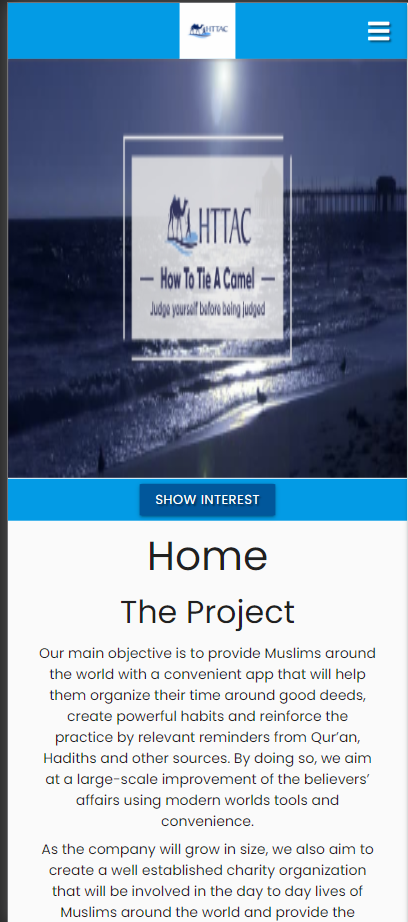
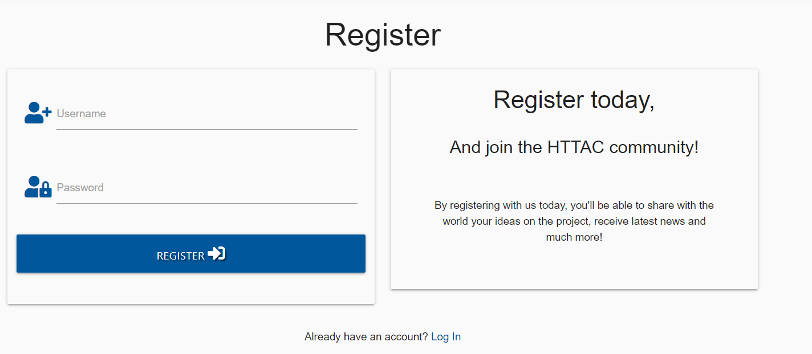
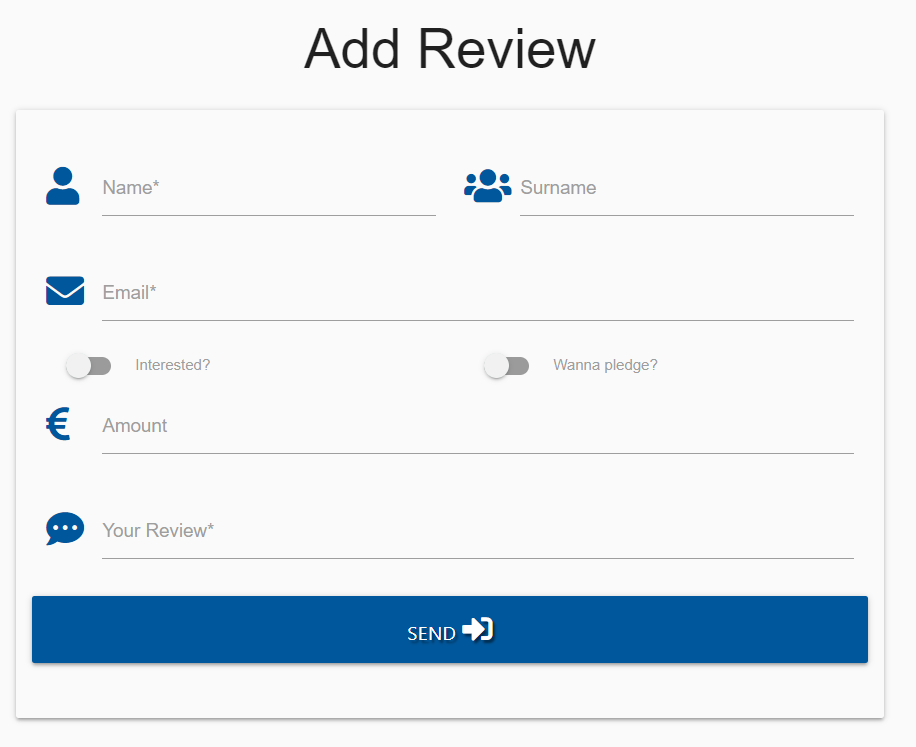
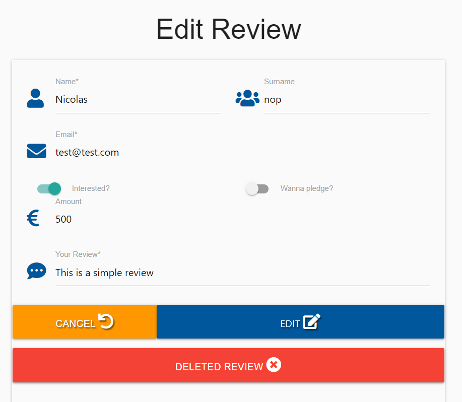

Welcome Nosjazz,

[View the live project here.](https://data-3.herokuapp.com/home)

This website has been created in order to complete the 3rd milestone project of the code institute fullstack diploma. This is a prelaunch website with a landing page centralizing the information, a About page giving more information about the project, a reviews page to centralize all reviews written, a contact us page, and a login/logout function.  HTML, CSS, JS, Python and MongoDB as well as Flask and Jquery were used. 


## User Experience (UX)

-   ### User stories

    -   #### First Time Visitor Goals

        1. As a First Time Visitor, I want to easily understand the main purpose of the project, leave if review and have the option to contact the website owner directly.
        2. As a First Time Visitor, I want to be see a visually compellent design.
        3. As a First Time Visitor, I want to be able to see reviews from other visitors.

    -   #### Returning Visitor Goals

        1. As a Returning Visitor, I want to find back the information I entered

-   ### Design
    -   #### Colour Scheme
        -   The main colours used are blue and white to have a high contrast, low eyes strain application.
    -   #### Typography
        -   The Poppins font is the main font used throughout the whole website with Sans Serif as the fallback font in case for any reason the font isn't being imported into the site correctly. Poppins is a simple font that is appealing for this purpose.
        
    -   #### Imagery
        -   The images used were kept minimum to convey a simmple design, keeping one for the company logo and banner, as well as one image to present to team members.

*   ### Wireframes

    -   Home Page [Wireframe](https://github.com/Nosjazz/milestone_3/tree/master/static/images/wireframes). Due to time contraints, the project was adaptated to conserve the minimum features, removing the Interested and Pledged below the banner, while also removing the banners for the contact Us, login and review Add page.

## Features

-   Responsive on all device sizes
<h2 align="center"></h2>
<h2 align="center"></h2>

-   Profile Creation
<h2 align="center"></h2>

-   Review Creation
<h2 align="center"></h2>

-   Review editing when Review-userID matches the userID of logged session
<h2 align="center"></h2>

## Technologies Used

### Languages Used

-   [HTML5](https://en.wikipedia.org/wiki/HTML5)
-   [CSS3](https://en.wikipedia.org/wiki/Cascading_Style_Sheets)
-   [JAVASCRIPT](https://en.wikipedia.org/wiki/JavaScript)
-   [Python](https://www.python.org/downloads/)

### Frameworks, Libraries & Programs Used

1. [MaterializeCss](https://materializecss.com/)
    - MaterializeCss was used to assist with the responsiveness and styling of the website.
1. [Hover.css:](https://ianlunn.github.io/Hover/)
    - Hover.css was used on the Font Awesome icons to add the color and rotation transition while being hovered over.
1. [Google Fonts:](https://fonts.google.com/)
    - Google fonts were used to import the 'Poppins' font into the style.css file which is used on all pages throughout the project.
1. [Font Awesome:](https://fontawesome.com/)
    - Font Awesome was used on all pages throughout the website to add icons for aesthetic and UX purposes.
1. [Git](https://git-scm.com/)
    - Git was used for version control by utilizing the Gitpod terminal to commit to Git and Push to GitHub.
1. [GitHub:](https://github.com/)
    - GitHub is used to store the projects code after being pushed from Git.
1. [Jquery](https://jquery.com/)
    - Jquery was used to enable interactive development used within Materialize framework.
1. [Flask](https://flask.palletsprojects.com/en/1.1.x/)
    - Flask was used to create templates, recuding the amount of code written in each page.
1. [MongoDB](https://www.mongodb.com/)
    - MongoDB was used to gather input from users, profile and reviews.
1. [Heroku](https://www.heroku.com/)
    - Heroky was used to enable to live deployment of the project, taking into accounts the dependencies required. 

## Testing

### Validators 

The CSS, JavaScript and Python Validator Services were used to validate every page of the project to ensure there were no syntax errors in the project.

-   [W3C CSS Validator](https://jigsaw.w3.org/css-validator/#validate_by_input) - No error
-   [JShint validator](https://jshint.com/) - No error
-   [PEP8 python validator](http://pep8online.com/checkresult) - No error

### Testing User Stories from User Experience (UX) Section


### Further Testing


### Known Bugs


## Deployment

## GitHub

#### GitHub Pages

The project was deployed to GitHub Pages using the following steps...

1. Log in to GitHub and locate the [GitHub Repository](https://github.com/Nosjazz/todo_list-milestone2)
2. At the top of the Repository (not top of page), locate the "Settings" Button on the menu.
3. Scroll down the Settings page until you locate the "GitHub Pages" Section.
4. Under "Source", click the dropdown called "None" and select "Master Branch".
5. The page will automatically refresh.
6. Scroll back down through the page to locate the now published site in the "GitHub Pages" section.

#### Forking the GitHub Repository

By forking the GitHub Repository we make a copy of the original repository on our GitHub account to view and/or make changes without affecting the original repository by using the following steps...

1. Log in to GitHub and locate the [GitHub Repository](https://github.com/Nosjazz/todo_list-milestone2)
2. At the top of the Repository (not top of page) just above the "Settings" Button on the menu, locate the "Fork" Button.
3. You should now have a copy of the original repository in your GitHub account.

#### Making a Local Clone

1. Log in to GitHub and locate the [GitHub Repository](https://github.com/Nosjazz/todo_list-milestone2)
2. Under the repository name, click "Clone or download".
3. To clone the repository using HTTPS, under "Clone with HTTPS", copy the link.
4. Open Git Bash
5. Change the current working directory to the location where you want the cloned directory to be made.
6. Type `git clone`, and then paste the URL you copied in Step 3.

```
$ git clone https://github.com/Nosjazz/todo_list-milestone2
```

7. Press Enter. Your local clone will be created.

```
$ git clone https://github.com/Nosjazz/todo_list-milestone2
> Cloning into `CI-Clone`...
> remote: Counting objects: 10, done.
> remote: Compressing objects: 100% (8/8), done.
> remove: Total 10 (delta 1), reused 10 (delta 1)
> Unpacking objects: 100% (10/10), done.
```

Click [Here](https://help.github.com/en/github/creating-cloning-and-archiving-repositories/cloning-a-repository#cloning-a-repository-to-github-desktop) to retrieve pictures for some of the buttons and more detailed explanations of the above process.

### Heroku 

#### Prerequisites: Install Git and the Heroku CLI
Git installation instructions

Heroku CLI installation instructions

#### Steps

1. Track your codebase in a Git repository
Heroku’s build system uses Git, the popular version control system. Consequently, your codebase needs to be committed to a Git repository in order to be deployed.

Git installation
First-time Git setup
If you are already using another version control system, consult its documentation for help exporting a snapshot to Git.

2. Add a Heroku Git remote
Every Heroku app has its own Heroku-hosted Git repo. You deploy new versions of your app by pushing your code changes to this repo. In order to do that, your local Git repo needs to know the URL of the Heroku-hosted repo.

Complete the step Creating a Heroku remote to add the Heroku-hosted repo as a Git remote.

3. Add a Procfile
Commit a text file to your app’s root directory that is named Procfile without a file extension. This file tells Heroku which command(s) to run to start your app. These commands are probably the same as the ones you use to run your code on your local machine.

Here’s an example Procfile for a simple Node.js app:

web: node app.js
The web process type defined above tells Heroku to start up your web application by running node app.js. The web process type is special, because it’s the only process type that can receive HTTP traffic from the web (i.e., from your app’s users).

You can specify additional process types on separate lines in your Procfile, but process types besides web can’t receive web traffic. Process types can be any alphanumeric string (hyphens and underscores are also allowed).

For example (Rails):

web: bundle exec rails server -p $PORT
worker: bundle exec rake jobs:work
Consult language-specific guides for more information on creating a Procfile for your chosen language and framework.

Learn more about the Procfile

4. Listen on the correct port
On your local machine, your app’s web server can listen on any open, unreserved port. On Heroku, however, it must listen on a specific port.

This specific port is indicated by the PORT environment variable. When your web server starts up on Heroku, make sure it’s listening on the port number specified by PORT:

app.listen(process.env.PORT);
To avoid having to set the PORT environment variable when running on your local machine, you can replace the line above with the following:

let port = process.env.PORT;
if (port == null || port == "") {
  port = 8000;
}
app.listen(port);
In this case, the server will listen on port 8000 if the PORT environment variable isn’t set.

The examples above are for a simple Node.js app that uses Express. Consult your programming language’s documentation and Heroku’s language-specific guides for details on both reading environment variables and configuring your web server to listen on a particular port.

5. Use a database or object storage instead of writing to your local filesystem
If your app currently writes data to its local filesystem for persistent storage (including to a local SQLite database), on Heroku it must instead write that data to one of the following locations (depending on your use case):

A managed database service (such as Heroku Postgres)
A managed object storage service (such as Amazon S3)
This requirement exists because Heroku dynos (the Linux containers that run your code) have an ephemeral filesystem. Your app’s dynos are automatically replaced at least once daily (this is called dyno cycling), and each time they are, any data your app has written to the local filesystem is lost.

Initially, this “stateless” design pattern for web apps can seem surprising and confusing. Learn more about the methodology behind it.

Provisioning a database
Heroku Postgres is Heroku’s managed SQL database service, and it is the recommended relational database for Heroku apps. Its free hobby-dev plan provides a good starting place for smaller apps, and for testing out the Heroku platform.

Learn how to provision Heroku Postgres, and then also run Postgres on your local machine to ensure parity between your development and production environments.

If you don’t want to use Heroku Postgres, add-ons for other relational databases (including MySQL and MongoDB) are available in the Heroku Elements Marketplace.

Provisioning an object storage service
Learn about using Amazon S3 on Heroku.

Add-ons for managing an S3 bucket are also available in the Heroku Elements Marketplace.

6. Complete language-specific setup
The changes above apply to all Heroku apps, regardless of programming language. In addition to them, language-specific changes might be necessary for your codebase.

## Credits

### Content

-   All content was written by the developer.

### Acknowledgements

-   My Mentor for his continuous helpful feedback.

-   Tutor support at Code Institute for their support.